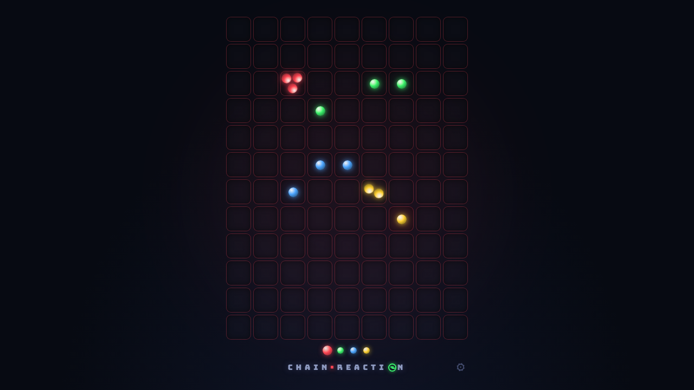
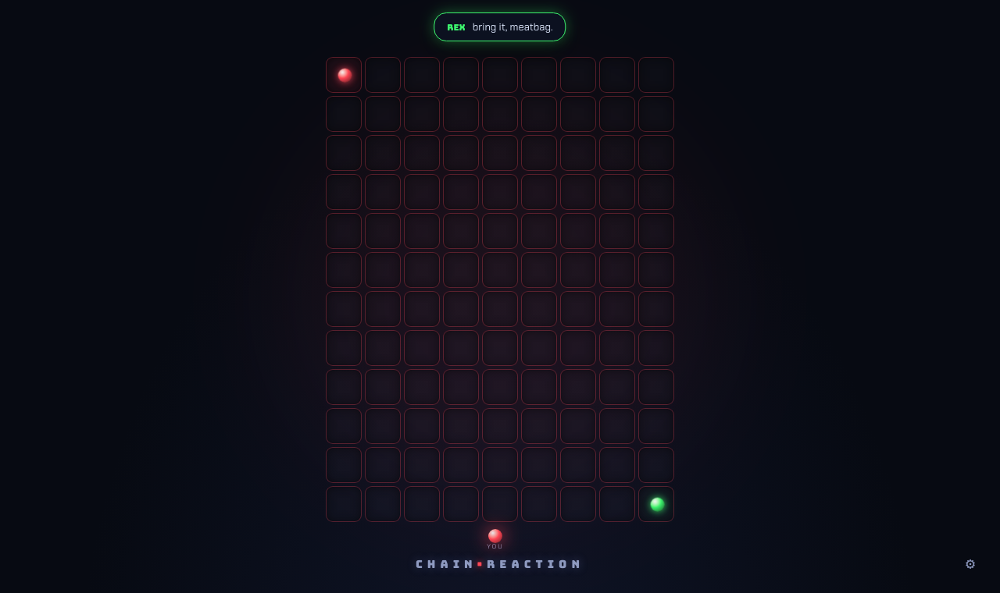
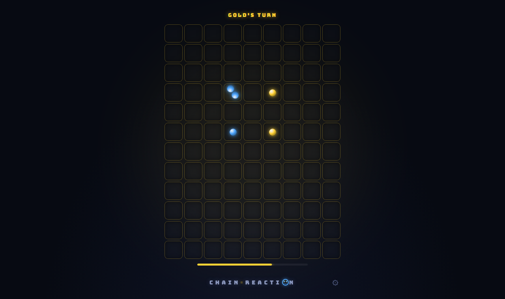
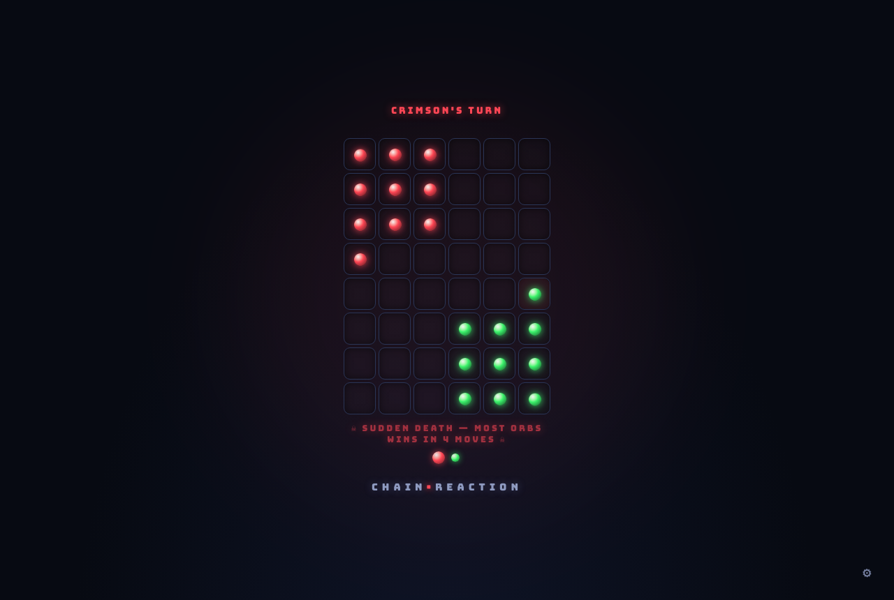
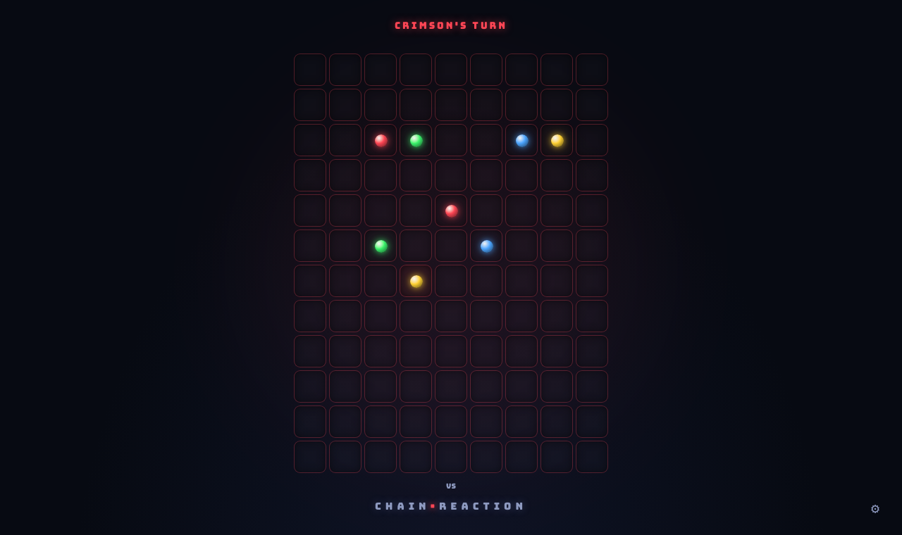
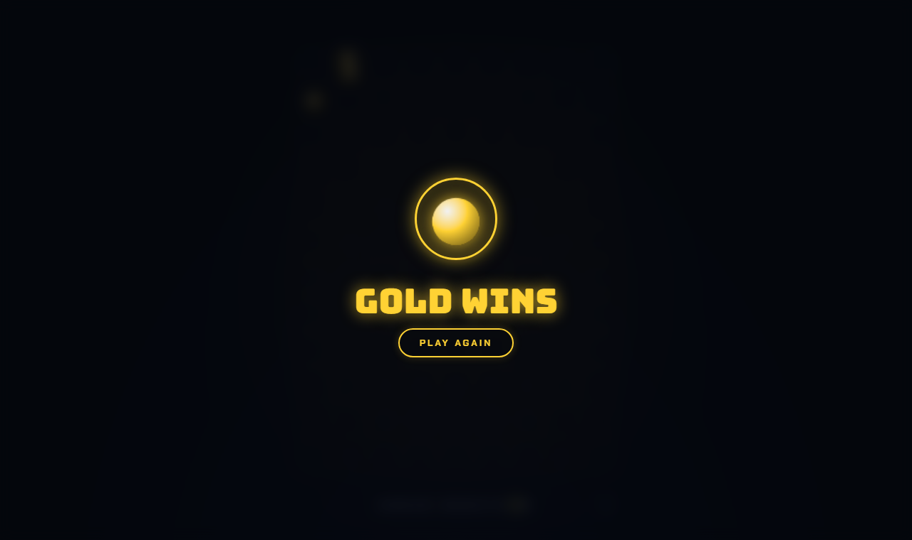
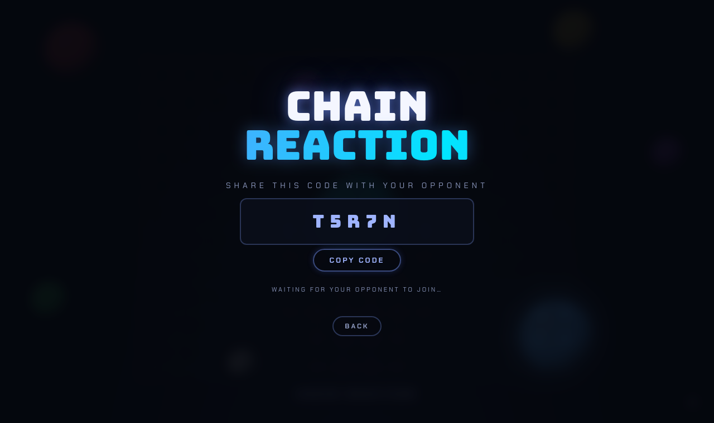

# ⚛️ Chain Reaction

[](https://github.com/tarunspartan/chain-reaction/actions/workflows/ci.yml)

A fast, neon-arcade take on the classic **Chain Reaction** strategy game — 2 to 8 players on one device or online across devices, solo against the CPU, installable to your home screen and playable offline.



## 📸 Screenshots

| Menu — local or online, mode, board size and players | vs CPU — REX talks trash |
| --- | --- |
|  |  |

| Blitz — beat the turn timer | Sudden Death — every fuse shortens |
| --- | --- |
|  |  |

| Teams — alpha vs omega | Win screen |
| --- | --- |
|  |  |

| Online lobby — room code, colours and ready state |
| --- |
|  |

## ✨ Features

- **2–8 players** (pass & play) — pick your own color; turn order follows your picks
- **Five game modes** (see below) including solo play against the CPU
- **Three board sizes** — Small (6×8), Medium (9×12), or Large (fills your screen)
- **Animated chain reactions** — explosion shockwaves resolve in accelerating waves with growing screen shake; orbs tremble when a cell is one orb from critical mass
- **Elimination play** — lose all your orbs and you're out; your turn is skipped; last player standing wins
- **Online play, up to 8 players** — host a room, share a code or an invite link, pick colors and ready up in a lobby; peer-to-peer, no account and no dedicated backend. Drop-outs are skipped, the host role migrates if the host leaves, and every rematch returns to the lobby so the mode can change
- **Dark neon UI** — the board glow always shows whose turn it is
- **Synthesized sound** — explosions get louder and brighter as chains deepen (Web Audio, zero assets)
- **PWA** — install it on your phone or desktop and play offline
- In-game tutorial with live animated diagrams, `prefers-reduced-motion` support

## 🕹️ Game Modes

| Mode | What changes |
| --- | --- |
| **Classic** | Pass & play, last player standing wins |
| **vs CPU** | You play first; bots take the other colors. Three difficulties, each with its own personality and trash-talk speech bubbles — **BLOB** (easy, lovable chaos), **REX** (medium, sassy), **VEGA** (hard, coldly calculating) |
| **Blitz** | 5–10 seconds per turn (scales with board size) — run out and a random cell is played for you |
| **Sudden Death** | Long games go to overtime — when the countdown ends, whoever holds the most orbs wins (ties play on) |
| **Teams** | 4/6/8 players in two teams (odd picks vs even picks) — eliminate the whole other side |

## 🌐 Online Play

**Up to 8 players across devices.** One player hosts and gets a short 5-character room code, plus an invite link that drops whoever opens it straight onto the color picker. Everyone else joins with the code, takes a color — which readies them up — and the host sets the mode and board size for the room. Classic, Blitz, Sudden Death and Teams are all playable online (vs CPU stays local, since the bots live on one device).

Between matches the whole room lands back in the lobby, so the host can switch mode or board size and everyone re-readies. That's the rematch flow: host proposes, everyone agrees, go again.

**Under the hood.** Players connect directly to each other over WebRTC; [Trystero](https://github.com/dmotz/trystero) handles matchmaking over the public Nostr relay network purely so the browsers can find each other. No account, no server of ours in the loop, and gameplay never touches the relay.

Two different problems get two different answers. The **lobby** is host-authoritative — the host owns the roster and broadcasts it whole, so colour clashes and joins racing a start are all resolved in one place. **Moves** are broadcast peer-to-peer with no relay hop: only one player can legally move at a time, so a single sequence number totally orders the match and every client replays the same stream through the same pure engine. Each move carries a checksum of the board it was played on, so a client that has drifted notices immediately and pulls a fresh snapshot instead of silently diverging.

**When things go wrong.** A player who drops is skipped rather than waited for — their orbs stay on the board as capturable obstacles, and the last player standing wins. If the *host* drops, the role migrates to the earliest-joined player still present (every client runs the same election, so they all agree) and the match carries on. Someone who joins mid-match waits in the lobby and plays the next one. In Blitz, a player whose tab is frozen gets played for by the host a few seconds after their clock runs out, so one backgrounded phone can't stall the room.

## 🎮 How to Play

Players take turns placing orbs in empty cells or cells they already own. Every cell has a **critical mass** — 2 in corners, 3 on edges, 4 in the center. When a cell reaches it, it **explodes**, throwing one orb into each neighbouring cell and **capturing** any opponent orbs there. Captured cells can explode too, setting off massive chain reactions.

A player who loses every orb is eliminated. Outlast everyone to win.

## 🛠️ Tech Stack

| Layer | Choice |
| --- | --- |
| Framework | [React 19](https://react.dev/) |
| Build tool | [Vite 8](https://vitejs.dev/) |
| Animation | [Motion](https://motion.dev/) (LazyMotion + CSS transforms for the board) |
| Multiplayer networking | [Trystero](https://github.com/dmotz/trystero) (serverless WebRTC matchmaking over public Nostr relays) |
| PWA | [vite-plugin-pwa](https://vite-pwa-org.netlify.app/) (Workbox service worker) |
| Fonts | Bungee + Chakra Petch |

The chain-reaction engine resolves explosions in simultaneous waves on a copied board, with win-checks mid-chain so endgame cascades terminate cleanly.

## 🚀 Getting Started

```bash
npm install
npm run dev       # dev server with HMR → http://localhost:5173
```

### Other scripts

```bash
npm run build     # production build → dist/
npm run preview   # serve the production build locally (PWA/offline only works here, not in dev)
npm test          # unit tests for the online protocol rules
npm run deploy    # build + publish dist/ to GitHub Pages
```

## 🔁 CI/CD

Every push and pull request runs the [CI/CD workflow](.github/workflows/ci.yml) on GitHub Actions:

- **CI** — checks out the repo, installs dependencies with `npm ci` (Node 22, cached), and runs the production build.
- **CD** — on pushes to `master`, the built `dist/` folder is pushed to the **`gh-pages`** branch via `peaceiris/actions-gh-pages`, which GitHub Pages serves from.
- **PR previews** — every pull request gets its own build deployed to `gh-pages` under `preview/pr-<number>/`, viewable at `https://tarunspartan.github.io/chain-reaction/preview/pr-<number>/` (link printed in the run summary). The preview is removed automatically when the PR closes.

> One-time setup: in the repo's **Settings → Pages**, set the source to **Deploy from a branch** → `gh-pages`. The `npm run deploy` script still works as a manual fallback.

## 🙏 Credits

Original game concept by Buddy-Matt Entertainment. Built with 💙 by [@tarunspartan](https://github.com/tarunspartan).
