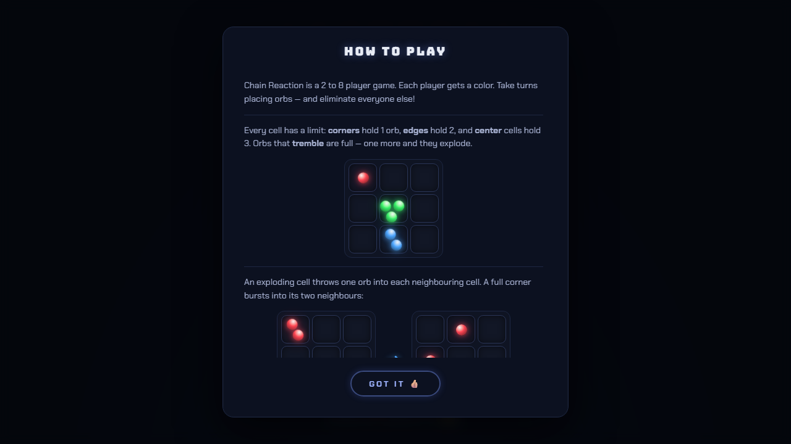

# ⚛️ Chain Reaction

A fast, neon-arcade take on the classic **Chain Reaction** strategy game — 2 to 8 players on one device, installable as a PWA, playable offline.


## 📸 Screenshots

| Start screen | Win screen | Tutorial |
| --- | --- | --- |
|  |  |  |

## ✨ Features

- **2–8 players** (pass & play) — each player gets one of 8 distinct neon colors
- **Three board sizes** — Small (6×8), Medium (9×12), or Large (fills your screen)
- **Animated chain reactions** — explosion shockwaves resolve in waves, orbs tremble when a cell is one orb from critical mass
- **Elimination play** — lose all your orbs and you're out; your turn is skipped; last player standing wins
- **Dark neon UI** — the board glow always shows whose turn it is
- **PWA** — install it on your phone or desktop and play offline
- Sound effects (toggleable), in-game tutorial with live animated diagrams, `prefers-reduced-motion` support

## 🎮 How to Play

Players take turns placing orbs in empty cells or cells they already own. Every cell has a **critical mass** — 2 in corners, 3 on edges, 4 in the center. When a cell reaches it, it **explodes**, throwing one orb into each neighbouring cell and **capturing** any opponent orbs there. Captured cells can explode too, setting off massive chain reactions.

A player who loses every orb is eliminated. Outlast everyone to win.

## 🛠️ Tech Stack

| Layer | Choice |
| --- | --- |
| Framework | [React 19](https://react.dev/) |
| Build tool | [Vite 8](https://vitejs.dev/) |
| Animation | [Motion](https://motion.dev/) (LazyMotion + CSS transforms for the board) |
| PWA | [vite-plugin-pwa](https://vite-pwa-org.netlify.app/) (Workbox service worker) |
| Fonts | Bungee + Chakra Petch |

The chain-reaction engine resolves explosions in simultaneous waves on a copied board, with win-checks mid-chain so endgame cascades terminate cleanly.

## 🚀 Getting Started

```bash
npm install
npm run dev       # dev server with HMR → http://localhost:5173
```

### Other scripts

```bash
npm run build     # production build → dist/
npm run preview   # serve the production build locally
npm run deploy    # build + publish dist/ to GitHub Pages
```

## 🗺️ Roadmap Ideas

- **Online multiplayer** — rooms & websockets for play across devices
- **vs. CPU** — AI opponents with difficulty levels
- **More game modes** — timed turns, team play, deathmatch variants
- **Stats & streaks** — local win tracking per color

## 🙏 Credits

Original game concept by Buddy-Matt Entertainment. Built with 💙 by [@tarunspartan](https://github.com/tarunspartan).
